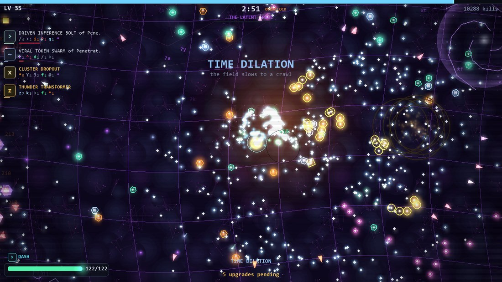
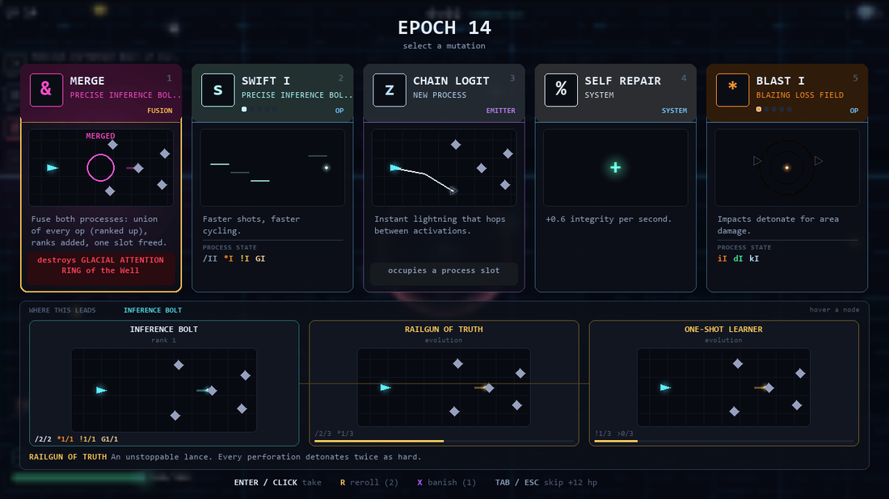
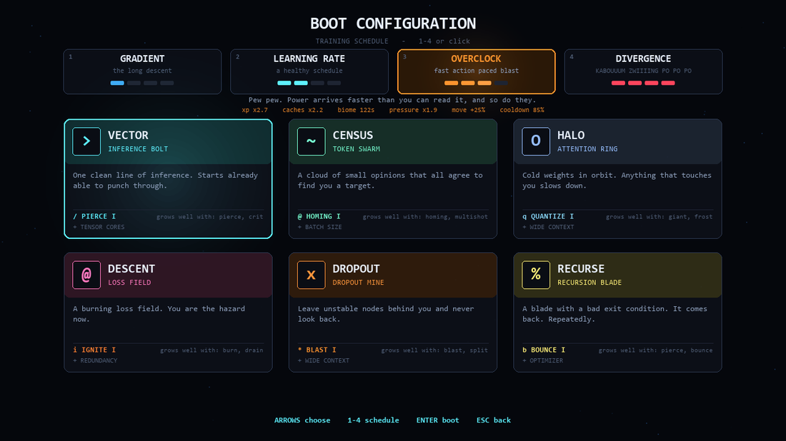
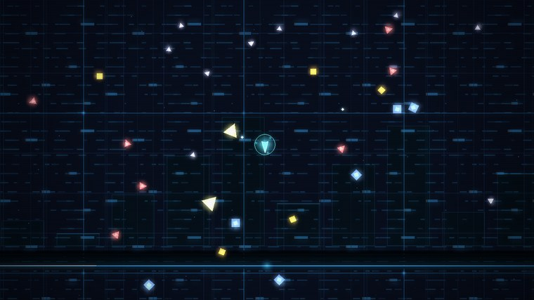
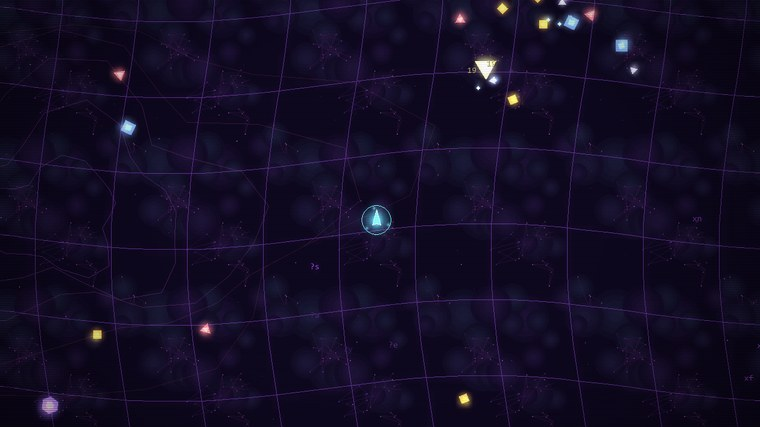
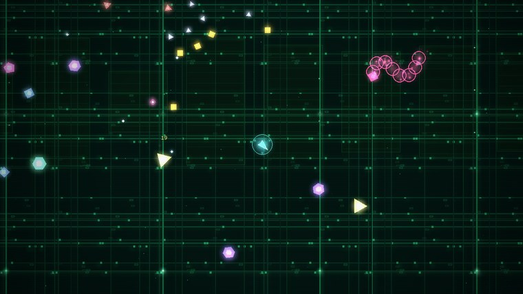
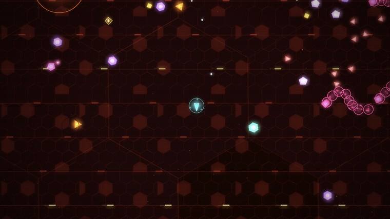
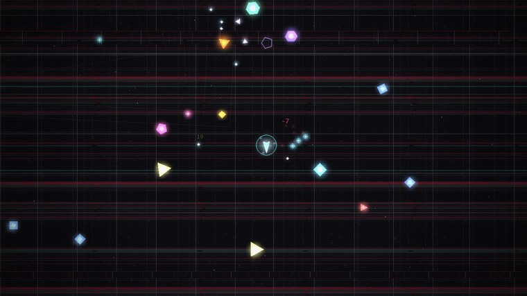
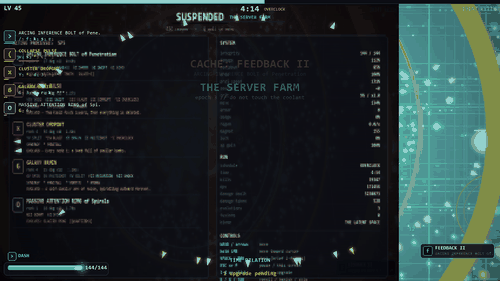
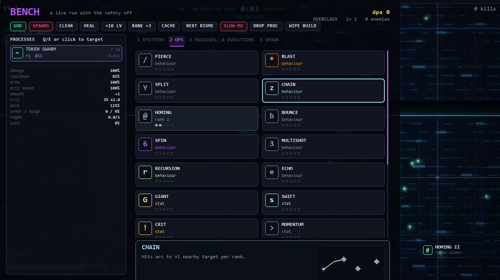

<div align="center">

# GRADIENT DESCENT

**an AI survivor (made by Claude Opus 5)**

*You are the model. They are the data. Survive the training run.*



</div>

A survivor-like written in plain Python and pygame. No sprites, no samples, no
asset pipeline: every shape on screen is drawn from vectors at runtime and every
sound — including the soundtrack — is synthesised with numpy when the game boots.

---

## Play it

**Windows** — grab `GradientDescent.exe` from the
[Releases](../../releases). One file, ~34 MB, no install, no Python. Your save
sits next to the exe, so it travels with it.

**From source** — Python 3.10+, two dependencies:

```bash
pip install -r requirements.txt
```

```bash
python main.py
```

`python main.py --res 1280x720` if you want to cap the render resolution; by
default the game renders natively at your display size, because it is all
vectors and there is nothing to upscale.

### Controls

| moving | |
|---|---|
| `WASD` or arrows | move |
| hold **LMB** | move toward the cursor |
| `F5` | mouse mode: pointer or virtual joystick |
| `SPACE` or **RMB** | dash, with a few i-frames |

| in a run | |
|---|---|
| `ESC` or `P` | pause and inspect the build |
| `TAB` | open the bench — sandbox runs only |
| `Q` | quit to the menu, from the pause screen |

| choosing an upgrade | |
|---|---|
| `1`–`5` or click | take it |
| `R` | reroll the offers |
| `X` | banish one — it will not be offered again this run |
| `TAB` or `ESC` | skip, and take +12 integrity instead |

| display | |
|---|---|
| `F6` | **screenshake: full / light / off** — late game shakes constantly, this stops it |
| `F11` or `Alt`+`Enter` | fullscreen |
| `F2` | bloom (the first thing dropped if the framerate slips) |
| `F4` | scanlines and vignette |
| `F3` | fps counter |
| `M` | mute |

---

## Weapons are processes, not items

You never pick up a gun. You run **processes**, and a process is one *emitter*
(how matter leaves the agent) plus a bag of ranked *ops* (what that matter then
does). Ops stack, interact, and rename the thing they are attached to.

- **12 emitters** — bolts, orbiting weights, a loss field, novas, sweeping
  beams, mines, chain lightning, turrets, returning blades, spirals, rain.
- **22 ops** — pierce, blast, split, chain, homing, bounce, spin, multishot,
  recursion, echo, giant, swift, crit, momentum, overclock, feedback, ignite,
  quantize, shock, corrupt, void, drain.
- **16 synergies** — declared combinations the projectile pipeline actually
  reads. `pierce 2 + blast 2` detonates on *every* perforation; `frost 2 +
  blast 2` shatters chilled targets; `split 2 + recursion 2` makes shards that
  split again.
- **17 evolutions** — accumulate the right shape and the process crystallises.
  `pierce 3 + blast 3` on a bolt becomes the RAILGUN OF TRUTH.
- **Fusion** — merge two processes into one, union of every op, one slot freed.

Offers are not random noise: they are weighted toward whatever would make your
current build *cohere* — ops that finish an evolution, ops that light up a
synergy, fusions that free a slot — and pushed apart, so five cards are never
five variations of the same idea. Every card runs the weapon it is offering, at
its real cadence and projectile count, and the panel underneath shows where that
process can still go: each evolution, its recipe, how far along you are, and what
it looks like when it lands.



---

## Four training schedules

The same run, at four speeds. Every dial moves together — including the
difficulty clock, which is compressed by the same factor as the biomes, so a
fast run is short, not easy.

| | xp | caches | biome | pressure | move | cooldown |
|---|---|---|---|---|---|---|
| **GRADIENT** — the long descent | ×1.0 | ×1.0 | 232 s | ×1.0 | +0% | 100% |
| **LEARNING RATE** — a healthy schedule | ×1.6 | ×1.45 | 172 s | ×1.3 | +12.5% | 95% |
| **OVERCLOCK** — fast action paced blast | ×2.7 | ×2.2 | 122 s | ×2.0 | +25% | 85% |
| **DIVERGENCE** — KABOUUUM ZWIIIING PO PO PO | ×5.2 | ×4.0 | 77 s | ×3.3 | +50% | 68% |



---

## Five biomes

Each one owns its far parallax, its baked substrate and one animated near layer
you actually read while playing — a read head sweeping the set, coordinates that
curve, coolant mains, packet lanes, a frame that tears.

<table>
<tr>
<td width="33%"><br><b>THE DATASET</b><br><i>clean, labelled, harmless</i></td>
<td width="33%"><br><b>THE LATENT SPACE</b><br><i>nothing here has a name</i></td>
<td width="33%"><br><b>THE SERVER FARM</b><br><i>do not touch the coolant</i></td>
</tr>
<tr>
<td><br><b>THE FIREWALL</b><br><i>you are not supposed to be here</i></td>
<td><br><b>MODEL COLLAPSE</b><br><i>it is only reading itself now</i></td>
<td>Each biome ends on a telegraphed multi-phase boss, then folds into the next one.</td>
</tr>
</table>

---

## Biome changes are a matmul

<div align="center">



</div>

The last frame of the old biome is treated as a textured plane in ℝ³, rotated by
a matrix in SO(3), pushed through a pinhole camera and eased back down to z = 0
while it dissolves into the biome underneath.

Because the plane is flat, the whole projection collapses into a single 3×3
matrix acting on homogeneous coordinates:

$$\begin{bmatrix}X\\Y\\w\end{bmatrix} = \begin{bmatrix}f r_{00} & f r_{01} & 0\\ f r_{10} & f r_{11} & 0\\ -r_{20} & -r_{21} & f\end{bmatrix}\begin{bmatrix}x\\y\\1\end{bmatrix},\qquad \text{screen}=(X/w,\ Y/w)$$

So the frame is resampled by inverting that matmul and gathering — one numpy
gather at a third of the resolution, 8.5 ms/frame from 720p to 1080p, where a
tiled `rotozoom` version cost 85. The matrix printed on screen during the fold
is the one being applied, recomputed every frame.

---

## Everything is generated

**Graphics.** Vectors and cached gradient surfaces. Bloom is a downscale, dim
and smooth-upscale additive pass; the particle budget adapts to the framerate on
its own, and bloom is the first thing dropped if the frame budget slips.

**Audio.** A synth rack rendered at boot in under a second: six pitched voices
(sub, bass, FM pluck, supersaw lead with delay, FM bell, detuned pad with
reverb), a full drum kit, and the SFX bank. The sequencer is chord-relative —
patterns store scale degrees and chord-tone indices, never absolute notes — so a
progression can walk underneath a riff and stay in key. Layers arrive with the
pressure you are under, the boss gets its own variant, and the phrase runs on
crossed 8-bar and 16-bar cycles so it does not loop on itself every two seconds.

Listen without launching the game:

```bash
python tools/audition.py
```

---

## The bench

Start a **SANDBOX** run from the title menu and `TAB` opens a live workshop:
install any emitter, op, passive or whole evolution recipe, spawn any archetype
or boss, freeze the spawns, jump biomes, and watch a live dps meter. The world is
paused while it is open; close it and whatever you just installed is immediately
firing at real enemies.



---

## Build the portable exe

```bash
python tools/build.py --zip
```

PyInstaller, one file, windowed, icon embedded, `--dir` if you prefer a folder
that starts instantly. The save falls back to `%APPDATA%` when the exe sits in a
read-only folder.

## Tools

| | |
|---|---|
| `tools/smoke.py` | drives the real `Game` object through every scene, headless |
| `tools/simulate.py` | headless soak test with a scripted player, `--pace` to pick a schedule |
| `tools/bench.py` | worst-case frame budget probe |
| `tools/bosstest.py` | every boss, every attack pattern, immortal player |
| `tools/shots.py` | renders a screenshot of every screen |
| `tools/audition.py` | renders the soundtrack to wav |
| `tools/build.py` | the portable executable |

## License

[Apache License 2.0](LICENSE).

## Layout

```
main.py          window, scenes, input, save
core/            settings, pacing profiles, math + surface cache, fx, audio
game/            world, director, player, enemies, bosses, weapons,
                 projectiles, combat, offers, pickups, levels, ui,
                 transition, sandbox
```
