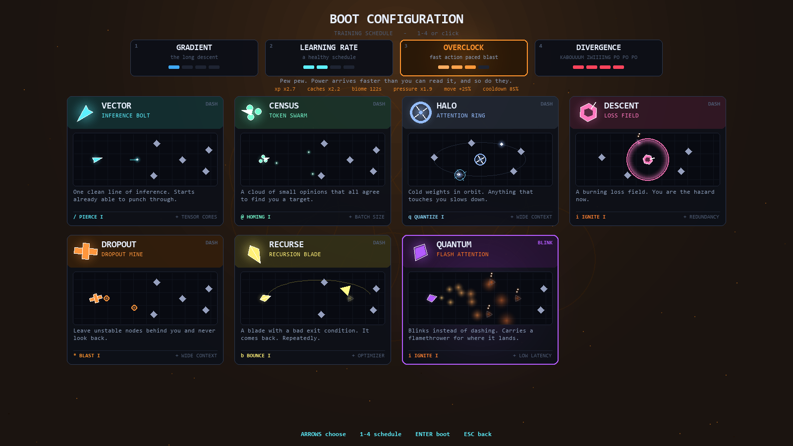
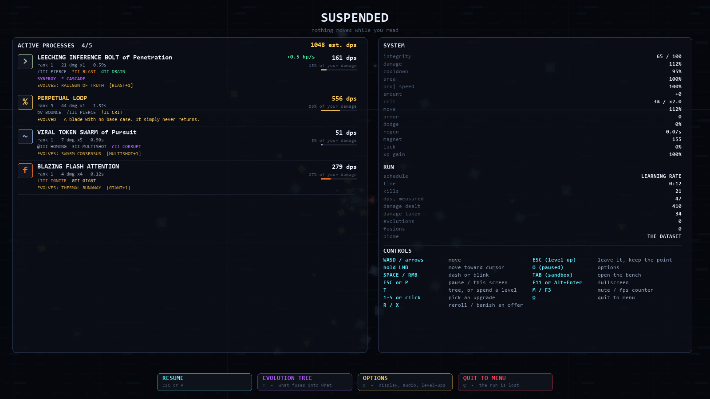
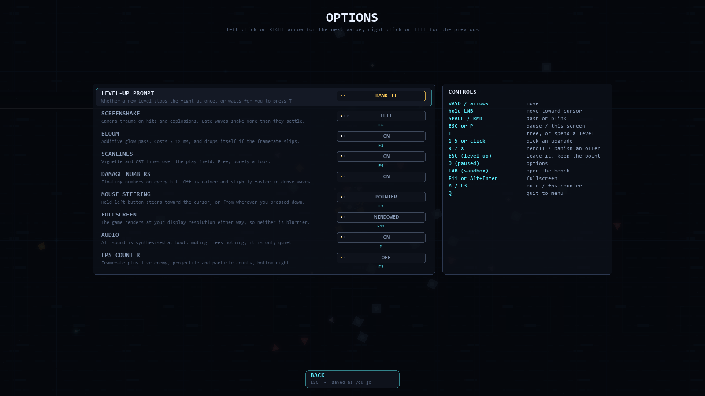
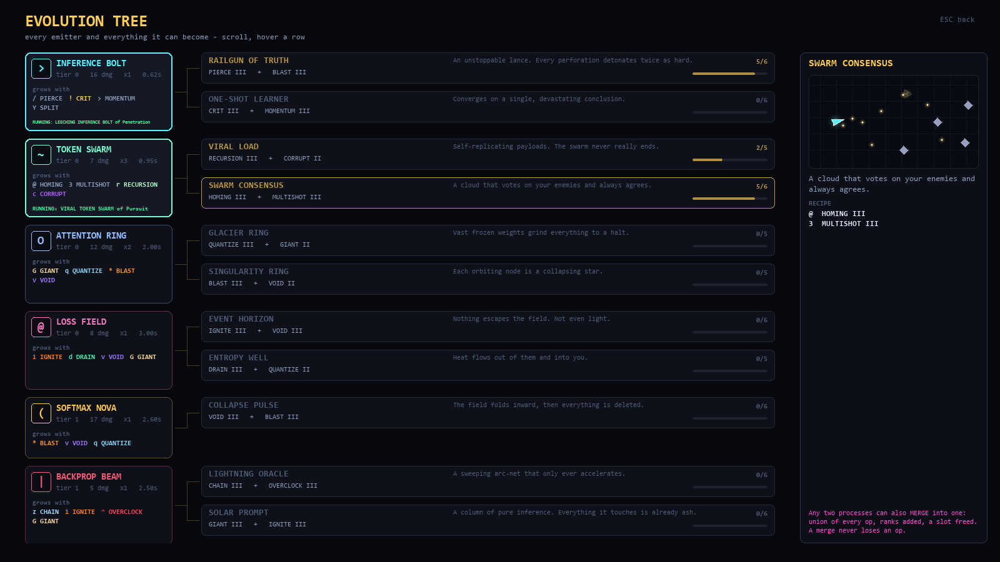

<div align="center">

# GRADIENT DESCENT

**an AI survivor (made by Claude Opus 5)**

*You are the model. They are the data. Survive the training run.*


</div>

A survivor-like written in plain Python and pygame. No sprites, no samples, no
asset pipeline: every shape on screen is drawn from vectors at runtime and every
sound — including the soundtrack — is synthesised with numpy when the game boots.

---

## Play it

**Windows** — grab `GradientDescent.exe` from the
[Releases](../../releases). One file, ~34 MB, no install, no Python. Your save
sits next to the exe, so it travels with it.

**From source** — Python 3.10+, two dependencies:

```bash
pip install -r requirements.txt
```

```bash
python main.py
```

`python main.py --res 1280x720` if you want to cap the render resolution; by
default the game renders natively at your display size, because it is all
vectors and there is nothing to upscale.

### Controls

| moving | |
|---|---|
| `WASD` or arrows | move |
| hold **LMB** | move toward the cursor |
| `F5` | mouse mode: pointer or virtual joystick |
| `SPACE` or **RMB** | dash, or blink if your unit blinks |

| in a run | |
|---|---|
| `ESC` or `P` | pause and inspect the build |
| `T` | spend a banked level — or open the evolution tree if none is waiting |
| `O` | options, from the pause screen |
| `TAB` | open the bench — sandbox runs only |
| `Q` | quit to the menu, from the pause screen |

| choosing an upgrade | |
|---|---|
| `1`–`5` or click | take it |
| `R` or the button | reroll the offers |
| `X` or the button | banish one — it will not be offered again this run |
| `T` or the button | open the full evolution tree |
| the **SKIP** button | spend the level on a full repair instead |
| `ESC` or **CLOSE** | leave, and keep the level for later |

Levels stack. Take them one at a time and the screen deals a fresh hand after
each pick; leave with `ESC` and the rest wait until you press `T`. Set
**LEVEL-UP PROMPT** to *BANK IT* in the options and the fight is never
interrupted at all.

| display | |
|---|---|
| `F6` | **screenshake: full / light / off** — late game shakes constantly, this stops it |
| `F11` or `Alt`+`Enter` | fullscreen |
| `F2` | bloom (the first thing dropped if the framerate slips) |
| `F4` | scanlines and vignette |
| `F3` | fps counter |
| `M` | mute |

All of these also live in **OPTIONS** — on the title screen, or one key from the
pause screen — and every one is written back to `save.json` as you change it.

---

## Weapons are processes, not items

You never pick up a gun. You run **processes**, and a process is one *emitter*
(how matter leaves the agent) plus a bag of ranked *ops* (what that matter then
does). Ops stack, interact, and rename the thing they are attached to.

- **13 emitters** — bolts, orbiting weights, a loss field, novas, sweeping
  beams, mines, stuttering chain lightning, a flamethrower, turrets, returning
  blades, spirals, rain.
- **22 ops** — pierce, blast, split, chain, homing, bounce, spin, multishot,
  recursion, echo, giant, swift, crit, momentum, overclock, feedback, ignite,
  quantize, shock, corrupt, void, drain. Every one of them does something on
  every emitter that advertises it, which was not always true: the impact ops
  used to live on a code path only plain projectiles ever reached, so an
  ATTENTION RING could carry BLAST III and feel nothing at all.
- **16 synergies** — declared combinations the projectile pipeline actually
  reads. `pierce 2 + blast 2` detonates on *every* perforation; `frost 2 +
  blast 2` shatters chilled targets; `split 2 + recursion 2` makes shards that
  split again.
- **19 evolutions** — accumulate the right shape and the process crystallises.
  `pierce 3 + blast 3` on a bolt becomes the RAILGUN OF TRUTH.
- **Fusion** — merge two processes into one. Every op survives at the better of
  the two ranks, shared ops gain a rank, the ranks add, and a slot is freed.
  Nothing is dropped, ever: a merge costs you a whole process, so it has to be
  worth paying for.

Offers are not random noise: they are weighted toward whatever would make your
current build *cohere* — ops that finish an evolution, ops that light up a
synergy, fusions that free a slot — and pushed apart, so five cards are never
five variations of the same idea. A free process slot always gets a weapon
offered for it.

Every card runs the weapon it is offering at its real cadence, projectile count
and op set — homing curves, bounce zigzags, split shatters, recursion relaunches
— and the panel underneath is a **before / after**: the weapon as it runs now,
the same weapon with this card taken, and every number that moves between them.
A global upgrade is shown landing on the weapon you actually have; a radius
upgrade is drawn to scale against the radius you actually have. Nothing is
truncated — titles wrap, and text shrinks to fit rather than being cut.

`T` opens the whole system as a tree: every emitter on the left, everything it
can become on the right, with the recipe, how far along you are, and the effect
running live.


---

## Seven units

A boot profile is a body, not a recolour: a dart, three lobes in orbit, a slotted
ring, a hex, a cross, a blade, a prism. Each starts on a different emitter with
one op already attached and one system upgrade banked. **QUANTUM** does not dash
at all — it blinks 210 px on a 1.15 s cooldown, and it carries the flamethrower,
because it will be standing in the middle of them.



---

## Four training schedules

The same run, at four speeds. Every dial moves together — including the
difficulty clock, which is compressed by the same factor as the biomes, so a
fast run is short, not easy.

| | xp | caches | biome | pressure | move | cooldown |
|---|---|---|---|---|---|---|
| **GRADIENT** — the long descent | ×1.0 | ×1.0 | 232 s | ×1.0 | +0% | 100% |
| **LEARNING RATE** — a healthy schedule | ×1.6 | ×1.45 | 172 s | ×1.3 | +12.5% | 95% |
| **OVERCLOCK** — fast action paced blast | ×2.7 | ×2.2 | 122 s | ×2.0 | +25% | 85% |
| **DIVERGENCE** — KABOUUUM ZWIIIING PO PO PO | ×5.2 | ×4.0 | 77 s | ×3.3 | +50% | 68% |


---

## Five biomes

Each one owns its far parallax, its baked substrate and one animated near layer
you actually read while playing — a read head sweeping the set, coordinates that
curve, coolant mains, packet lanes, a frame that tears.

<table>
<tr>
<td width="33%"><br><b>THE DATASET</b><br><i>clean, labelled, harmless</i></td>
<td width="33%"><br><b>THE LATENT SPACE</b><br><i>nothing here has a name</i></td>
<td width="33%"><br><b>THE SERVER FARM</b><br><i>do not touch the coolant</i></td>
</tr>
<tr>
<td><br><b>THE FIREWALL</b><br><i>you are not supposed to be here</i></td>
<td><br><b>MODEL COLLAPSE</b><br><i>it is only reading itself now</i></td>
<td>Each biome ends on a telegraphed multi-phase boss, then folds into the next one. Beating the last one is a milestone, not an ending: the run keeps going, the endless counter takes the ramp up a notch per lap, and only dying stops it. The end screen keeps a board per schedule.</td>
</tr>
</table>

---

## Biome changes are a matmul

<div align="center">


</div>

The last frame of the old biome is treated as a textured plane in ℝ³, rotated by
a matrix in SO(3), pushed through a pinhole camera and eased back down to z = 0
while it dissolves into the biome underneath.

Because the plane is flat, the whole projection collapses into a single 3×3
matrix acting on homogeneous coordinates:

$$\begin{bmatrix}X\\Y\\w\end{bmatrix} = \begin{bmatrix}f r_{00} & f r_{01} & 0\\ f r_{10} & f r_{11} & 0\\ -r_{20} & -r_{21} & f\end{bmatrix}\begin{bmatrix}x\\y\\1\end{bmatrix},\qquad \text{screen}=(X/w,\ Y/w)$$

So the frame is resampled by inverting that matmul and gathering — one numpy
gather at a third of the resolution, 8.5 ms/frame from 720p to 1080p, where a
tiled `rotozoom` version cost 85. The matrix printed on screen during the fold
is the one being applied, recomputed every frame.

---

## Everything is generated

**Graphics.** Vectors and cached gradient surfaces. Bloom is a downscale, dim
and smooth-upscale additive pass; the particle budget adapts to the framerate on
its own, and bloom is the first thing dropped if the frame budget slips.

**Audio.** A synth rack rendered at boot in under a second: six pitched voices
(sub, bass, FM pluck, supersaw lead with delay, FM bell, detuned pad with
reverb), a full drum kit, and the SFX bank. The sequencer is chord-relative —
patterns store scale degrees and chord-tone indices, never absolute notes — so a
progression can walk underneath a riff and stay in key. Layers arrive with the
pressure you are under, the boss gets its own variant, and the phrase runs on
crossed 8-bar and 16-bar cycles so it does not loop on itself every two seconds.

Listen without launching the game:

```bash
python tools/audition.py
```

---

## The bench

Start a **SANDBOX** run from the title menu and `TAB` opens a live workshop:
install any emitter, op, passive or whole evolution recipe, spawn any archetype
or boss, freeze the spawns, jump biomes, and watch a live dps meter. Left click
adds a rank, right click takes one back, and every process has a delete button,
so a wrong turn costs nothing. The schedule and the unit can be swapped from the
top strip without restarting, the process slot count is a dial, and every button
carries its own description. **START RUN** drops you back into the fight with
whatever you just built.


Pausing mid-run (`ESC`) tells you the same thing about the build you actually
have: every process lists its estimated dps, what share of your damage it is
carrying, and how much integrity it hands back if it drains. The estimate is a
model of the projectile pipeline — pierce saturating, chain falling off, split
going geometric once FRACTAL lands — with every coefficient fitted against
measured damage from `tools/`, not guessed. Median error against the simulation
is about 1%; two extreme op stacks on area emitters are off by ~3x.



---

## Nothing is hidden in a config file

`O` from the pause screen, or **OPTIONS** on the title. Every toggle says what it
is for and what it costs, carries the function key it has always had, and is
written back to `save.json` the moment you change it.

The first row is the one that changes how the game plays: **LEVEL-UP PROMPT** set
to *BANK IT* means a new level never interrupts the fight. It stacks in the corner
until you press `T`, and then the screen deals you one hand per banked level until
you run out or press `ESC` — which keeps whatever is left.



---

## The tree

`T` from the field or the pause screen, `T` on the level-up screen, or the last
page of the codex. Every emitter on the left, everything it can crystallise into on the
right, the recipe for each, how far the process you are running has got along it,
and the evolution playing live in the panel beside it.



---

## Build the portable exe

```bash
python tools/build.py --zip
```

PyInstaller, one file, windowed, icon embedded, `--dir` if you prefer a folder
that starts instantly. The save falls back to `%APPDATA%` when the exe sits in a
read-only folder.

## Tools

| | |
|---|---|
| `tools/smoke.py` | drives the real `Game` object through every scene, headless |
| `tools/simulate.py` | headless soak test with a scripted player, `--pace` to pick a schedule |
| `tools/bench.py` | worst-case frame budget probe |
| `tools/bosstest.py` | every boss, every attack pattern, immortal player |
| `tools/shots.py` | renders a screenshot of every screen |
| `tools/audition.py` | renders the soundtrack to wav |
| `tools/build.py` | the portable executable |

## License

[Apache License 2.0](LICENSE).

## Layout

```
main.py          window, scenes, input, save
core/            settings, pacing profiles, math + surface cache, fx, audio
game/            world, director, player, enemies, bosses, weapons,
                 projectiles, combat, offers, pickups, levels, ui,
                 transition, sandbox
```
